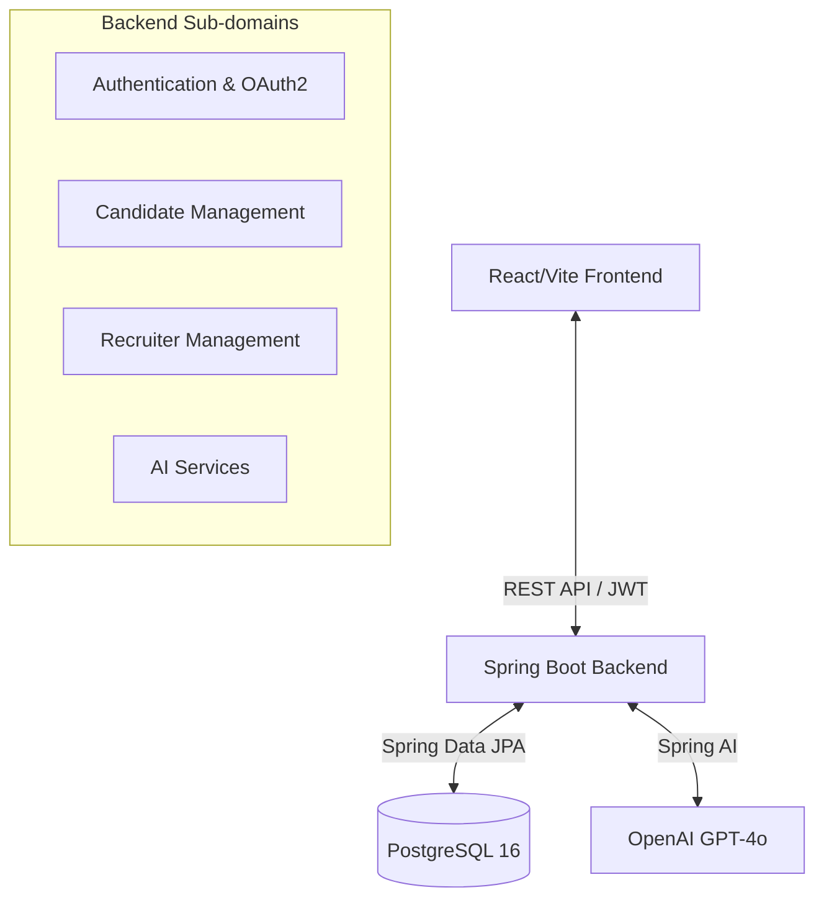

# ResumeAI

ResumeAI is a full-stack Applicant Tracking System (ATS) built with Java 21, Spring Boot 4.0.3, Spring AI, PostgreSQL, React 18+, Vite, and TailwindCSS. It leverages OpenAI's GPT-4o model to intelligently analyze, score, match, and tailor candidate resumes for job postings.

## Architecture



## Tech Stack
- **Backend:** Java 21, Spring Boot 4.0.3, Spring AI 2.0.0-M2, Spring Security (JWT + OAuth2), Spring Data JPA, Flyway, PostgreSQL, Apache PDFBox, Swagger/OpenAPI.
- **Frontend:** React 18, TypeScript, Vite, TailwindCSS, shadcn/ui, Recharts, React Router, Axios.
- **Infrastructure:** Docker Compose (for DB).

## Prerequisites
- Java 21
- Maven
- Node.js 18+ and npm
- Docker (optional, for running PostgreSQL easily)
- An active OpenAI API Key
- Google OAuth2 Client ID & Secret (for Google Login)

## Setup Guide

### 1. Database Setup
You can use the provided `docker-compose.yml` to spin up a PostgreSQL instance:
```bash
docker-compose up -d
```
*The database name is `resumeai`, user `postgres`, password `postgres`.* Flyway migrations will run automatically on application startup.

### 2. Backend Configuration
1. Copy `.env.example` to `.env` in the root directory:
   ```bash
   cp .env.example .env
   ```
2. Update the `.env` file with your actual keys:
   ```properties
   DB_URL=jdbc:postgresql://localhost:5432/resumeai
   DB_USERNAME=postgres
   DB_PASSWORD=postgres
   OPENAI_API_KEY=sk-your-real-openai-api-key
   GOOGLE_CLIENT_ID=your-google-client-id
   GOOGLE_CLIENT_SECRET=your-google-client-secret
   JWT_SECRET=your-very-secure-jwt-secret-key-that-is-long-enough
   ```
3. Run the backend:
   ```bash
   ./mvnw spring-boot:run
   ```
   *The backend will run on `http://localhost:8080`.*
   *API Documentation (Swagger UI) is available at `http://localhost:8080/swagger-ui.html`.*

### 3. Frontend Configuration
1. Navigate to the frontend directory:
   ```bash
   cd resumeai-frontend
   ```
2. Install dependencies:
   ```bash
   npm install
   ```
3. Start the dev server:
   ```bash
   npm run dev
   ```
   *The frontend will run on `http://localhost:5173`.*

## Edge Cases Handled in AI Prompts
- Instructions explicitly enforce strict JSON output schemas.
- Prompts forbid fabricating or "hallucinating" skills or experiences the candidate does not have.
- Prompts are designed to handle non-standard resume formats by focusing on text extraction content.

## API Overview
- `POST /api/auth/register`, `/login`, `/complete-oauth` - Authentication
- `POST /api/candidate/resume/upload` - Upload PDF resume
- `POST /api/candidate/resume/{id}/score` - Trigger async ATS scoring
- `POST /api/candidate/resume/{id}/analyze-compatibility` - Compare resume to JD
- `POST /api/recruiter/jobs` - Manage Job Postings
- `POST /api/recruiter/jobs/{id}/find-candidates` - Trigger async candidate matching
